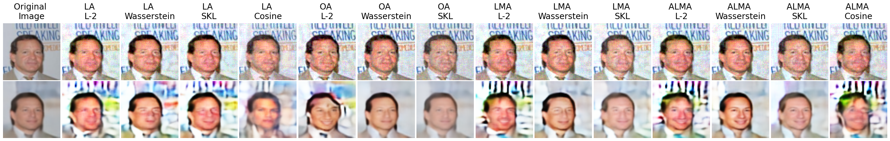
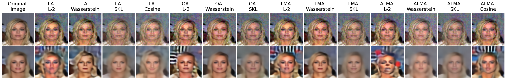
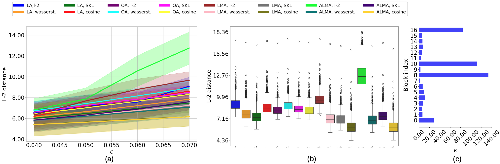
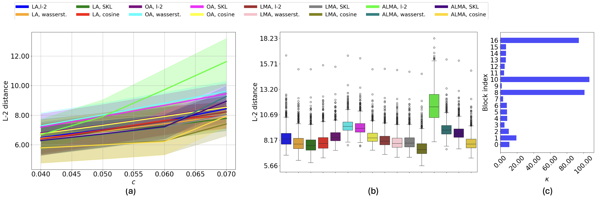
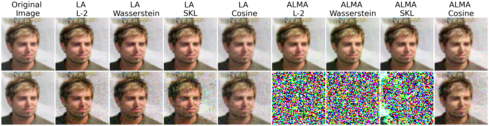
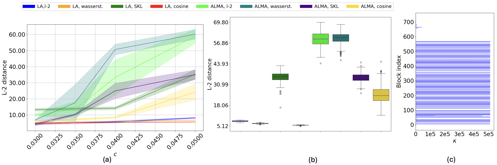
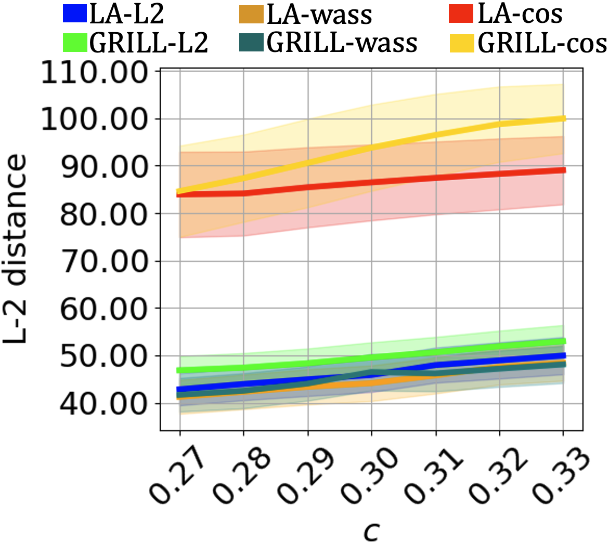
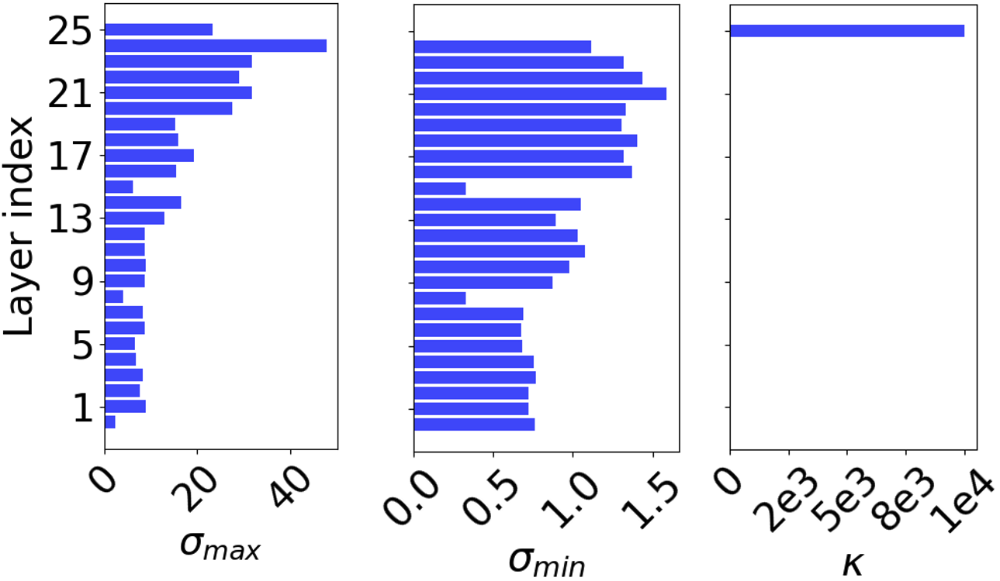

# grill
Gradient Signal Restoration in Ill-Conditioned Layers to Enhance
Adversarial Attacks on Autoencoders

# Code for beta-VAE and TC-VAE attacks

##### Install conda environment for adversarial attacks on beta-VAE and TC-VAE

<pre>
```
conda env create -f environment1.yml

```
</pre>


##### Initial setting up

To clone the repository, cd into the repository and create and activate the environment, run the below commands:

<pre>
```
git clone https://github.com/ChethanKodase/alma.git
cd alma
conda env create -f environment1.yml
conda activate your_env
```
</pre>

Command Arguments: 
1. `desired_norm_l_inf`:  L-infinity bound on the added adversarial noise
2. `attck_type` : Choose the attack method from `la_l2, la_wass, la_cos, grill_l2, grill_wass, grill_cos`. Descriptions for these methods are given in our paper
3. `data_directory` : address of the CelebA images directory
4. `attack_store_location` : Directory where the optimized noise is saved
5. `which_gpu` : Enter the index of the GPU you want to use 
6. `epsilon_list` : Give the norm bound values separated by space
7. `beta_value` : inidcates the importance given to the KL-Divergence term in the training Loss
8. `batch_size` : Batch size during training
9. `epochs`: traiining epochs
10. `lr` : learning rate
11. `run_time_plot_dir` : directory to save plots during model training
12. `runtime_plots_location` : directory to save plots during attack optimization
13. `checkpoint_storage` : directory to save VAE traiining checkpoints
14. `model_type` or `which_model` : input `VAE` if you want to train or attack `Beta-VAE`, `TCVAE` in case you want to train or attack TC-VAE
15. `num_steps` : Number of epochs during attack optimization. 
16. `model_location` : Location where the trained model is stored

Follow the below commands and instructions: 

##### Training beta-VAE:

<pre>
```
python beta_tc_vaes/beta_vae_celebA_training.py --which_gpu 1 --beta_value 5.0 --data_directory /home/luser/autoencoder_attacks/train_aautoencoders/data_cel1 --batch_size 64 --epochs 200 --lr 1e-4 --run_time_plot_dir a_training_runtime --checkpoint_storage vae_checkpoints
```
</pre>

##### Training TC-VAE:

Training TC-VAE
<pre>
```
python beta_tc_vaes/TC_vae_celebA_training.py  --which_gpu 1 --beta_value 5.0 --data_directory /home/luser/autoencoder_attacks/train_aautoencoders/data_cel1 --batch_size 64 --epochs 200 --lr 1e-4 --run_time_plot_dir a_training_runtime --checkpoint_storage vae_checkpoints
```
</pre>

##### TO get condition number of TC-VAE and beta VAE : 

<pre>
```
python beta_tc_vaes/betaVAE_tcVAE_conditioning_analysis.py  --which_gpu 1 --beta_value 5.0 --which_model VAE --checkpoint_storage vae_checkpoints
python beta_tc_vaes/betaVAE_tcVAE_conditioning_analysis.py  --which_gpu 1 --beta_value 5.0 --which_model TCVAE --checkpoint_storage vae_checkpoints
```
</pre>
The condition number plots will b e stored in `alma/conditioning_analysis`

##### Maximum damage attack on beta-VAE and TC-VAE

##### universal attacks: 

<pre>
```
python beta_tc_vaes/betaVAE_all_kinds_of_attacks_universal.py  --which_gpu 1 --beta_value 5.0 --attck_type latent_l2 --which_model VAE --desired_norm_l_inf 0.1 --data_directory /home/luser/autoencoder_attacks/train_aautoencoders/data_cel1 --model_location vae_checkpoints  --num_steps 300 --runtime_plots_location beta_tc_vaes/optimization_time_plots --attack_store_location beta_tc_vaes/univ_attack_storage
```
</pre>
Change `--desired_norm_l_inf` value to required L-inf norm bound on the perturbation 
Change the arguments for `--attck_type` to `latent_l2, latent_wasserstein, latent_cosine, output_attack_l2, output_attack_wasserstein, output_attack_cosine, lma_l2, lma_wass, lma_cos, grill_l2, grill_wass, grill_cos` to run attacks using rest of all the methods



*Qualitative comparision of β-VAE, c = 0.05*



*Qualitative comparision of TC-VAE, c = 0.05*


##### To compare the different adversarial objectives for universal attacks for a given L_infinity norm bound:

<pre>
```
python beta_tc_vaes/analysis_universal_box_plots.py --beta_value 5.0 --which_gpu 1 --model_location vae_checkpoints --l_inf_bound 0.07 --which_model VAE --data_directory /home/luser/autoencoder_attacks/train_aautoencoders/data_cel1 --box_plots_directory box_plots --uni_noise_directory beta_tc_vaes/univ_attack_storage
```
</pre>

assign which_model -> TCVAE to plot the same for TCVAE


##### To get qualitative image plots comparing maximum damage attacks between different methods

<pre>
```
python beta_tc_vaes/analysis_universal_image_plots.py --data_directory /home/luser/autoencoder_attacks/train_aautoencoders/data_cel1 --model_location /home/luser/autoencoder_attacks/saved_celebA/checkpoints --qualitative_plots_directory /home/luser/alma/universal_qualitative --uni_noise_directory /home/luser/autoencoder_attacks/robustness_eval_saves_univ/relevancy_test/layerwise_maximum_damage_attack
```
</pre>


*Comparison of universal adversarial attacks on β-VAE under 0.04 ≤ c ≤ 0.07*


*Comparison of universal adversarial attacks on TC-VAE under 0.04 ≤ c ≤ 0.07*

##### To train adversarial filter plugin

<pre>
```
python beta_tc_vaes/betaVAE_tcVAE_attack_filter.py  --which_gpu 0 --beta_value 5.0 --which_model VAE --desired_norm_l_inf 0.09 --model_location /home/luser/autoencoder_attacks/saved_celebA/checkpoints --data_directory /home/luser/autoencoder_attacks/train_aautoencoders/data_cel1 --num_steps 300 --filter_location /home/luser/alma/beta_tc_vaes/filter_storage --uni_noise_directory /home/luser/autoencoder_attacks/robustness_eval_saves_univ/relevancy_test/layerwise_maximum_damage_attack
```
</pre>

##### To plot damage distribution for all epsilon values

<pre>
```
python beta_tc_vaes/analysis_universal_epsilon_variation.py --which_gpu 1 --data_directory /home/luser/autoencoder_attacks/train_aautoencoders/data_cel1 --which_model TCVAE --model_location /home/luser/autoencoder_attacks/saved_celebA/checkpoints --uni_noise_directory /home/luser/autoencoder_attacks/robustness_eval_saves_univ/relevancy_test/layerwise_maximum_damage_attack --damage_distributions_address /home/luser/alma/damage_distributions_variation
```
</pre>

# Code for NVAE attacks

We consider the official implementation of NVAE from https://github.com/NVlabs/NVAE. We take the pretrained weights from  the oficial publishers and implement adversarial attacks

#### clone the nvae official repository using the code below: 

<pre>
```
git clone https://github.com/NVlabs/NVAE.git
```
</pre>


Follow the instructions from https://github.com/NVlabs/NVAE and download the checkpoints for celebA 64 dataset from https://drive.google.com/drive/folders/14DWGte1E7qnMTbAs6b87vtJrmEU9luKn 

Command Arguments: 
1. `desired_norm_l_inf`:  L-infinity bound on the added adversarial noise
2. `attck_type` : Choose the attack method from `la_l2, la_wass, la_cos, grill_l2, grill_wass, grill_cos`. Descriptions for these methods are given in our paper
3. `nvae_checkpoint_path` : Address of the downloaded trained NVAE model weights from the publishers of https://arxiv.org/abs/2007.03898 , code: https://github.com/NVlabs/NVAE
4. `your_data_directory` : address of the FFHQ images directory
5. `uni_noise_path` : Directory where the optimized noise is saved
6. `which_gpu` : Enter the index of the GPU you want to use 


#### To create the environment and install dependencies for adversarial attacks on NVAAE

<pre>
```
conda deactivate
cd alma
python -m venv nvaeenv
source nvaeenv/bin/activate
pipenv install -r requirements.txt
```
</pre>


#### To get condition number plots for NVAE

<pre>
```
python nvae/nvae_all_condition_analysis.py --nvae_checkpoint_path ../NVAE/pretrained_checkpoint
```
</pre>


#### To run universal adversarial attacks on NVAE

<pre>
```
cd alma/
source nvaeenv/bin/activate
python nvae/nvae_all_kids_of_attacks_universal.py --attck_type "grill_wass" --desired_norm_l_inf 0.035 --data_directory your_data_directory --nvae_checkpoint_path your_check_point_path
python nvae/nvae_all_kids_of_attacks_universal.py --attck_type "grill_skl" --desired_norm_l_inf 0.035 --data_directory your_data_directory --nvae_checkpoint_path your_check_point_path
python nvae/nvae_all_kids_of_attacks_universal.py --attck_type "grill_cos" --desired_norm_l_inf 0.035 --data_directory your_data_directory --nvae_checkpoint_path your_check_point_path
python nvae/nvae_all_kids_of_attacks_universal.py --attck_type "la_l2" --desired_norm_l_inf 0.035 --data_directory your_data_directory --nvae_checkpoint_path your_check_point_path
python nvae/nvae_all_kids_of_attacks_universal.py --attck_type "la_wass" --desired_norm_l_inf 0.035 --data_directory your_data_directory --nvae_checkpoint_path your_check_point_path
python nvae/nvae_all_kids_of_attacks_universal.py --attck_type "la_skl" --desired_norm_l_inf 0.035 --data_directory your_data_directory --nvae_checkpoint_path your_check_point_path
python nvae/nvae_all_kids_of_attacks_universal.py --attck_type "la_cos" --desired_norm_l_inf 0.035 --data_directory your_data_directory --nvae_checkpoint_path your_check_point_path
```
</pre>


*Qualitative comparision of NVAE, c = 0.05*


#### To plot distributions of maximum damage attacks using all attacks methods for a given perturbation norms

<pre>
```
python nvae/nvae_all_convergence_qualitative_plots_universal_box_plots.py --data_directory data_cel1 --nvae_checkpoint_path ../NVAE/pretrained_checkpoint --uni_noise_path ../NVAE/attack_run_time_univ/attack_noise --desired_norm_l_inf 0.05```
</pre>


#### To plot distributions of maximum damage attacks using all attacks methods for different perturbation norms

<pre>
```
python nvae/nvae_all_convergence_epsilon_variation.py --data_directory ../data_cel1 --nvae_checkpoint_path ../NVAE/pretrained_checkpoint --uni_noise_path ../NVAE/attack_run_time_univ/attack_noise

```
</pre>



*Comparison of universal adversarial attacks on NVAE under 0.03 ≤ c ≤ 0.05*


#### To perform universal adaptive attacks for NVAE and plot the results

<pre>
```
python nvae/nvae_all_kids_of_attacks_universal_adaptive.py --attck_type "grill_l2_mcmc" --desired_norm_l_inf 0.035 --data_directory ../data_cel1 --nvae_checkpoint_path ../NVAE/pretrained_checkpoint
python nvae/nvae_all_kids_of_attacks_universal_adaptive.py --attck_type "grill_l2_mcmc" --desired_norm_l_inf 0.04 --data_directory ../data_cel1 --nvae_checkpoint_path ../NVAE/pretrained_checkpoint
python nvae/nvae_all_kids_of_attacks_universal_adaptive.py --attck_type "grill_l2_mcmc" --desired_norm_l_inf 0.05 --data_directory ../data_cel1 --nvae_checkpoint_path ../NVAE/pretrained_checkpoint

python nvae/nvae_all_kids_of_attacks_universal_adaptive.py --attck_type "la_wass_mcmc" --desired_norm_l_inf 0.035 --data_directory ../data_cel1 --nvae_checkpoint_path ../NVAE/pretrained_checkpoint
python nvae/nvae_all_kids_of_attacks_universal_adaptive.py --attck_type "la_wass_mcmc" --desired_norm_l_inf 0.04 --data_directory ../data_cel1 --nvae_checkpoint_path ../NVAE/pretrained_checkpoint
python nvae/nvae_all_kids_of_attacks_universal_adaptive.py --attck_type "la_wass_mcmc" --desired_norm_l_inf 0.05 --data_directory ../data_cel1 --nvae_checkpoint_path ../NVAE/pretrained_checkpoint


python nvae/nvae_all_convergence_epsilon_variation_adaptive.py --data_directory ../data_cel1 --nvae_checkpoint_path ../NVAE/pretrained_checkpoint --uni_noise_path nvae/univ_attack_storage/


```
</pre>


#### To compare the gradient norms and loss gradients' partial derivate histograms of Existing attacks and GRILL for NVAE.


<pre>
```
python nvae/nvae_all_kids_of_attacks_universal.py --attck_type "grill_l2_pr" --desired_norm_l_inf 0.05 --data_directory ../data_cel1 --nvae_checkpoint_path ../NVAE/pretrained_checkpoint
python nvae/nvae_all_kids_of_attacks_universal.py --attck_type "la_l2_pr" --desired_norm_l_inf 0.05 --data_directory ../data_cel1 --nvae_checkpoint_path ../NVAE/pretrained_checkpoint

python nvae/reviews_plotting_grad_norms_histograms.py


```
</pre>

# Code of DiffAE attacks


Command Arguments: 
1. `desired_norm_l_inf`:  L-infinity bound on the added adversarial noise
2. `attck_type` : Choose the attack method from `la_l2, la_wass, la_cos, grill_l2, grill_wass, grill_cos`. Descriptions for these methods are given in our paper
3. `diffae_checkpoint` : Address of the downloaded trained DiffAE model weights from the publishers of https://arxiv.org/pdf/2111.15640 , code: https://github.com/phizaz/diffae 
4. `ffhq_images_directory` : address of the FFHQ images directory
5. `noise_directory` : Directory where the optimized noise is saved
6. `which_gpu` : Enter the index of the GPU you want to use 
7. `epsilon_list` : Give the norm bound values separated by space


#### Install the conda environment required and activate:


<pre>
```
conda env create -f environment2.yml
cd alma
conda activate your_diffae_environment
```
</pre>


#### To get layerwise condition numbers plots for DiffAE:


Follow https://github.com/phizaz/diffae to download the checkpoints and FFHQ dataset. Replace `../diffae/checkpoints` with the location of your saved DiffAE checkpoints. 

<pre>
```
python diffae/autoencoding_diffAE_conditioning_analysis.py --which_gpu 5 --diffae_checkpoint ../diffae/checkpoints
```
</pre>

Layerwise condition number chart will be saved to `alma/conditioning_analysis`


#### To optimize universal adversarial attacks on DiffAE:

<pre>
```
python diffae/autoencoding_attack_universal.py --desired_norm_l_inf 0.35 --attck_type grill_cos --which_gpu 7 --diffae_checkpoint ../diffae/checkpoints --ffhq_images_directory ../diffae/imgs_align_uni_ad
```
</pre>
Optimized noise will be saved in `alma/diffae/noise_storage`


*Qualitative comparision of DiffAE, c = 0.33*

#### To plot adversrial reconstruction loss distribution for all attack methods for a set of L-infinity norms 

<pre>
```
python diffae/attack_universal_quantitative.py --desired_norm_l_inf 0.31 --which_gpu 7 --diffae_checkpoint ../diffae/checkpoints --ffhq_images_directory ../diffae/imgs_align_uni_ad --noise_directory ../diffae/attack_run_time_univ/attack_noise
python diffae/attack_convergence_epsilon_variation.py --epsilon_list 0.27 0.28 0.29 0.3 0.31 0.32 0.33
```
</pre>




*Comparison of universal adversarial attacks on DiffAE under 0.27 ≤ c ≤ 0.33*


#### To run adaptive attacks and plot the results

<pre>
```
cd alma
conda activate dt2
python diffae/autoencoding_attack_universal.py --desired_norm_l_inf 0.27 --attck_type la_cos_mcmc2 --which_gpu 4 --diffae_checkpoint ../diffae/checkpoints --ffhq_images_directory ../diffae/imgs_align_uni_ad
python diffae/autoencoding_attack_universal.py --desired_norm_l_inf 0.27 --attck_type grill_cos_mcmc2 --which_gpu 5 --diffae_checkpoint ../diffae/checkpoints --ffhq_images_directory ../diffae/imgs_align_uni_ad

python diffae/attack_universal_quantitative_adaptive.py --desired_norm_l_inf 0.33 --which_gpu 1 --diffae_checkpoint ../diffae/checkpoints --ffhq_images_directory ../diffae/imgs_align_uni_ad --noise_directory diffae/noise_storage
python diffae/attack_convergence_epsilon_variation_adaptive.py --epsilon_list 0.27 0.3 0.33


```
</pre>

#### To compare the gradient norms of Existing attacks and GRILL.


<pre>
```
python diffae/autoencoding_attack_universal.py --desired_norm_l_inf 0.33 --attck_type grill_cos_pr1 --which_gpu 1 --diffae_checkpoint ../diffae/checkpoints --ffhq_images_directory ../diffae/imgs_align_uni_ad
python diffae/autoencoding_attack_universal.py --desired_norm_l_inf 0.33 --attck_type grill_cos_pr_rnd1 --which_gpu 2 --diffae_checkpoint ../diffae/checkpoints --ffhq_images_directory ../diffae/imgs_align_uni_ad
python diffae/autoencoding_attack_universal.py --desired_norm_l_inf 0.33 --attck_type grill_cos_pr_unif1 --which_gpu 3 --diffae_checkpoint ../diffae/checkpoints --ffhq_images_directory ../diffae/imgs_align_uni_ad

python diffae/review_plotting_abalation.py
```
</pre>


#### To compare the histograms norms of Existing attacks and GRILL.


<pre>
```
python diffae/autoencoding_attack_universal.py --desired_norm_l_inf 0.33 --attck_type la_cos_pr --which_gpu 4 --diffae_checkpoint ../diffae/checkpoints --ffhq_images_directory ../diffae/imgs_align_uni_ad
python diffae/autoencoding_attack_universal.py --desired_norm_l_inf 0.33 --attck_type grill_cos_pr_rnd1 --which_gpu 2 --diffae_checkpoint ../diffae/checkpoints --ffhq_images_directory ../diffae/imgs_align_uni_ad
python diffae/review_plotting.py
```
</pre>


#### For sample specific attacks

<pre>
```
cd alma
conda activate dt2
python autoencoding_attack.py --source_segment 10 --desired_norm_l_inf 0.08 --attck_type latent_l2 --which_gpu 2 
```
</pre>

Read me updates
